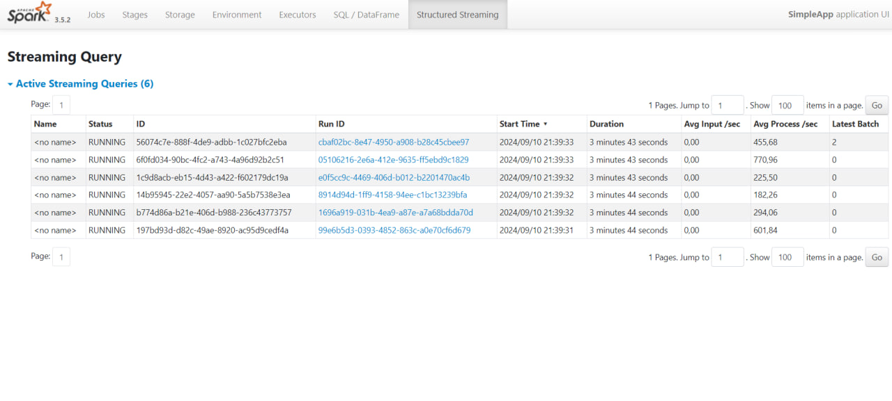
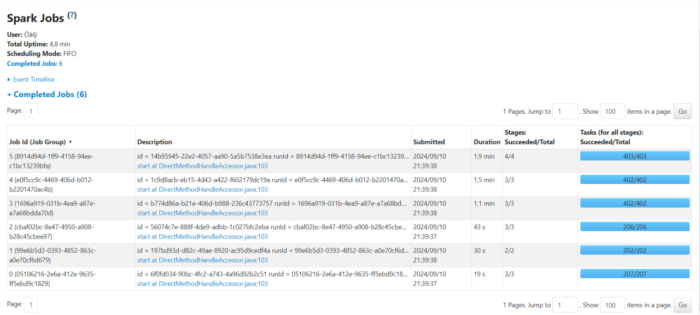
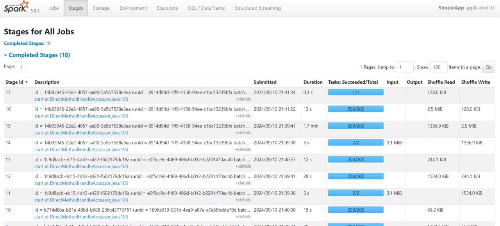

# PySpark homework

This PySpark pipeline handles new CSV files that might be added to the **raw** folder over time. The pipeline processes data and checks for duplicated records. Then the data is cleaned, transformed and written to Parquet files which are stored in **transformed** folder. 

Run the **main.py** file to start the streaming service.

## Functions:
* setup_session - creates a session, sets a schema and starts a read stream
* clean_data - removes duplicate records by checking name, host_id and coordinates of the listing; filters out listings without price and coordinates; converts the date field and sets a default value if date is missing 
* transform_data - adds price_range and price_per_review fields; also adds processing_time field in order to run sql queries correctly
* query data - runs queries against transformed data 
* check_data - checks if any records have a null value in price, minimum_nights or availability_365 field

To access **Spark UI** open in browser http://localhost:4040/ 

#### Screenshots from Spark UI

